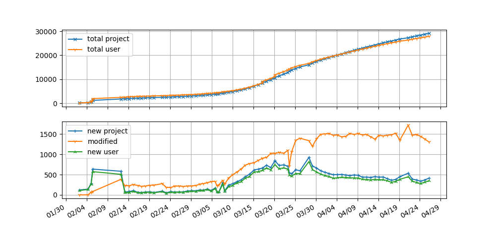

[[中文](README-zh.md)]

this simple script uses keyword in `search_keywords.old.txt` and `search_keywords.txt` for collecting projects related to [COVID-19](https://en.wikipedia.org/wiki/COVID-19).

For the plot below, timestamp is from git log, and the result is related to when my bot updates the csv data, also after adding new searching keyword, the count could suddenly increase a lot, so this plot is not very objective and accurate.

